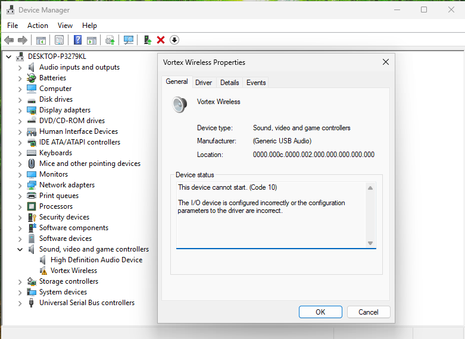
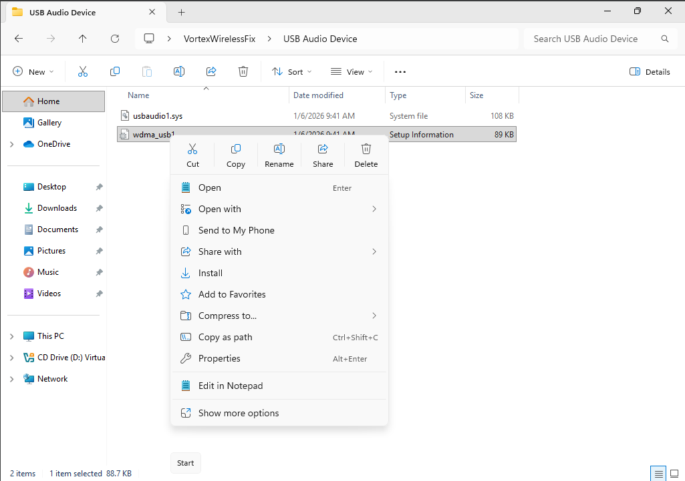
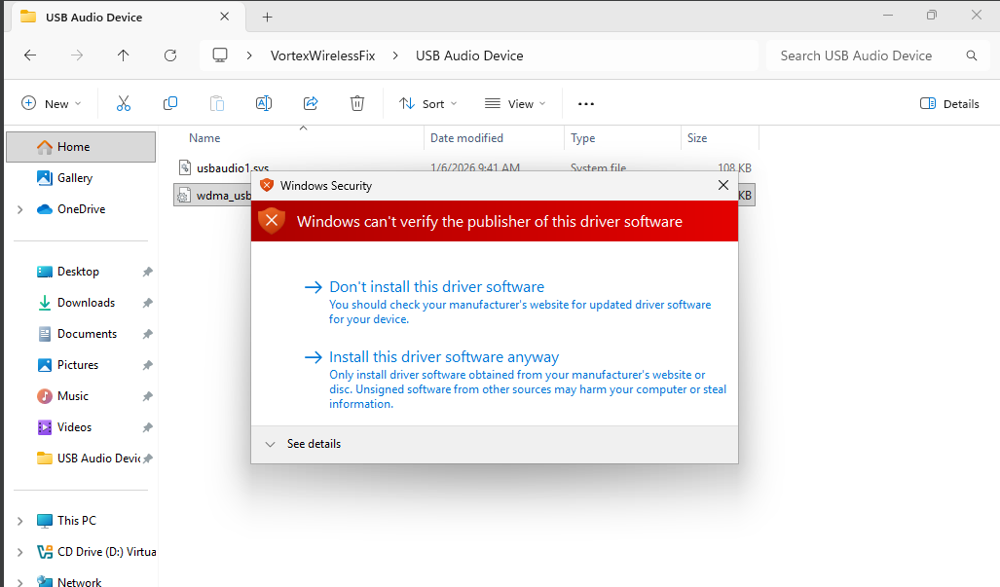
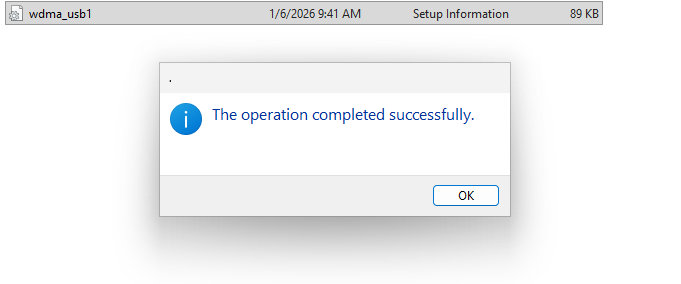
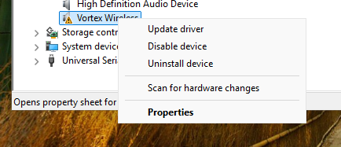
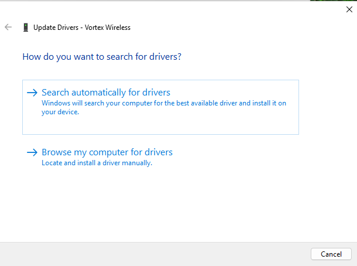
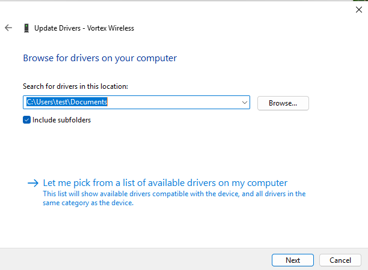
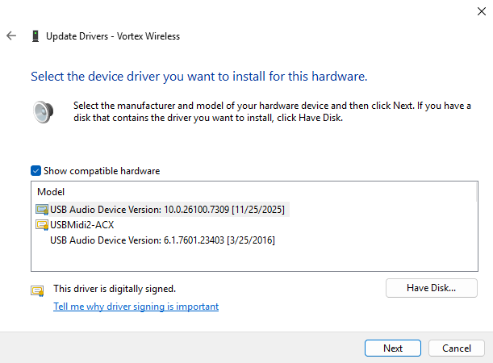
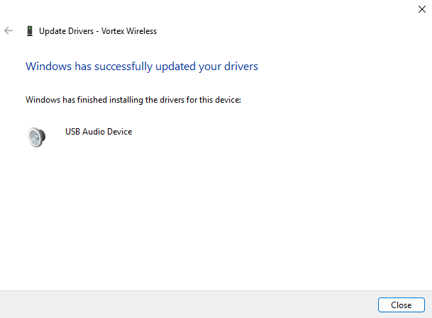
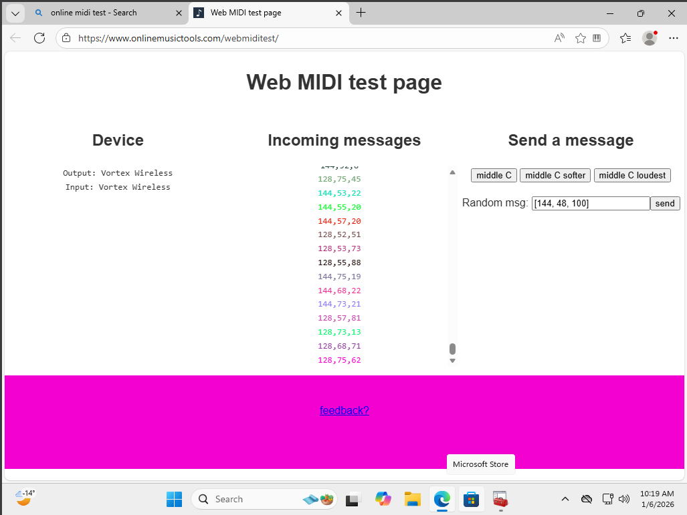

**DISCLAIMER: I am by no means an expert at the inner buildings of Windows, I am just a fellow user who bought Alesis Vortex Wireless 1 secondhandely, tried to make it work on Windows 10/11 and had a success after a while, so I can't make sure that it will work on future versions of Windows.**

- [Problem I am solving](#problem-i-am-solving)
- [How to make it work on Windows 10/11 (and maybe 8, but I haven't checked that)](#how-to-make-it-work-on-windows-1011-and-maybe-8-but-i-havent-checked-that)

# Problem I am solving

# How to make it work on Windows 10/11 (and maybe 8, but I haven't checked that)

0. Clone or download repository, of course
1. Disable driver signature enforcement (**I exported drivers from Windows 7 using Double Driver utility and it didn't retain digital signature, I guess**)
    1. Restart to **Safe Mode** (hold Shift and click Restart)
    2. When a blue screen appears, go to Troubleshoot --> Advanced Options --> Startup Settings
    3. Click Restart
    4. When another blue screen appears, press 7 or F7 (disable driver signature enforcement)
    5. Wait for your OS to restart.
 2. Install old drivers
    1. Open folders and find .inf files (**wdma_usb1.inf** and **wdmaudio1.inf**)
    2. I will install one for example. 
    Right-click and install them 
    3. A window will appear warning you that this driver is unsigned, but everything is fine, so **click Install this driver software anyway** 
    If there are no issues, a window will appear confirming that driver is installed 
3. Update driver for your keytar
   1. Go to Device Manager
   2. Find your device, **right-click on it and click Update driver** 
   3. Choose **Browse my computer for drivers** 
   4. Choose **Let me pick from a list of available drivers on my computer** 
   5. Choose **USB Audio Device Version 6.1.7601.23403 \[3/25/2016\]** 
   6. If there are no issues, such window will appear 
4. Congratulations, your keytar is back to life! 
**Note: you will need to use Safe mode for drivers to work because Windows doesn't load unsigned drivers by default, or you can find info on how to sign them yourself**

Now you can check that your keytar is sending MIDI messages to PC (using [this page](https://www.onlinemusictools.com/webmiditest) for example)

